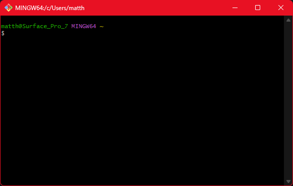

# Exercise 2

This is a small summerise of GitHub.

---

## Definition

GitHub serves as a developer platform facilitating the creation, storage, management, and sharing of code.
It integrates Git for version control with features like access control, issue tracking, task management, and
continuous integration. Acquired by Microsoft in 2018, GitHub is a prominent hub for hosting open-source projects.
By January 2023, it had amassed over 100 million developers and 420 million repositories,
establishing itself as the largest source code host globally by June 2023.
---

## Commands

| Command       | Description                                                                     |
|---------------|---------------------------------------------------------------------------------|
| `git config`  | Configure Git settings for the user                                             |
| `git init`    | Initialize a new Git repository in the current directory                        |
| `git commit`  | Save changes to the repository index                                            |
| `git status`  | Show the status of the working directory and the index                          |
| `git add`     | Add files to the index to prepare them for a commit                             |
| `git log`     | Show the history of commits                                                     |
| `git diff`    | Show differences between commits, working directory, and index                  |
| `git pull`    | Fetch changes from a remote repository and integrate them into the local branch |
| `git push`    | Push local commits to a remote repository                                       |

---

## Logo

---

## Screenshots

### Git Bash

Git Bash is a command-line interface that allows users to execute Git commands and Unix commands on Windows systems,
providing a Unix-like environment for working with Git.

---

## Source

[GitHub - Wikipedia](https://en.wikipedia.org/wiki/GitHub)

---

