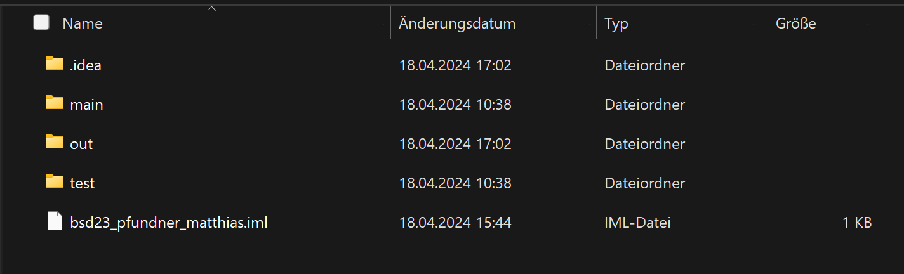
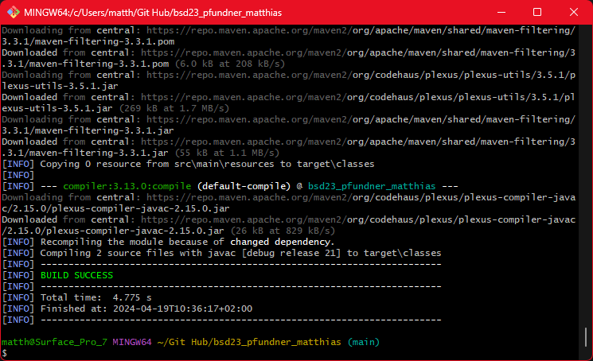
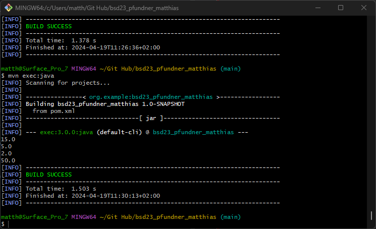

# Exercise 3

Documentation of the implementation of Maven.

---

## Versions
### Maven
Apache Maven 3.9.6 (bc0240f3c744dd6b6ec2920b3cd08dcc295161ae)
Maven home: C:\Program Files\apache-maven-3.9.6
Java version: 21, vendor: Oracle Corporation, runtime: C:\Program Files\Java\jdk-21
Default locale: de_AT, platform encoding: UTF-8
OS name: "windows 11", version: "10.0", arch: "amd64", family: "windows"

### Java
java version "21" 2023-09-19 LTS
Java(TM) SE Runtime Environment (build 21+35-LTS-2513)
Java HotSpot(TM) 64-Bit Server VM (build 21+35-LTS-2513, mixed mode, sharing)

### Javac
javac 21

---

## Changes
After the first execution of the Main class, a folder named "out" is automatically generated by IntelliJ
to store compiled bytecode and other generated files. Also a new folder ".idea" was created.

--- 

## Screenshots

The folder structure after the first execution of the program. 

---

This picture shows the success build with the command "mvn compile".

---

This picture displays the output of the mvn exec:java command,
showing the results of the Java application's execution.

