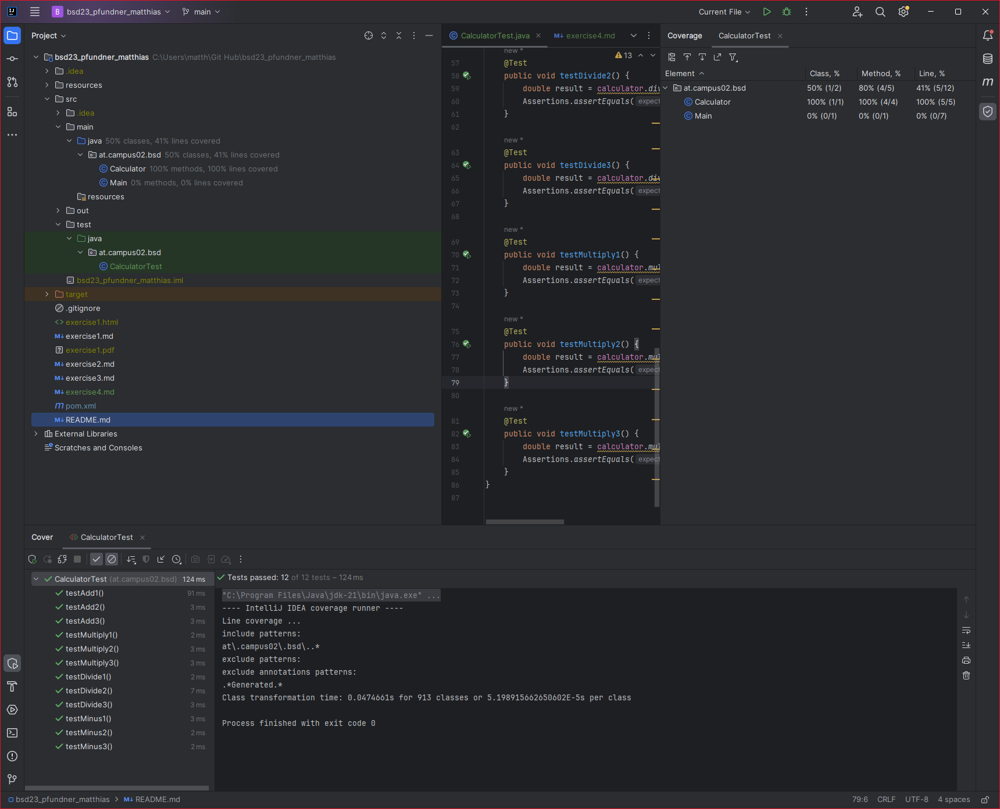
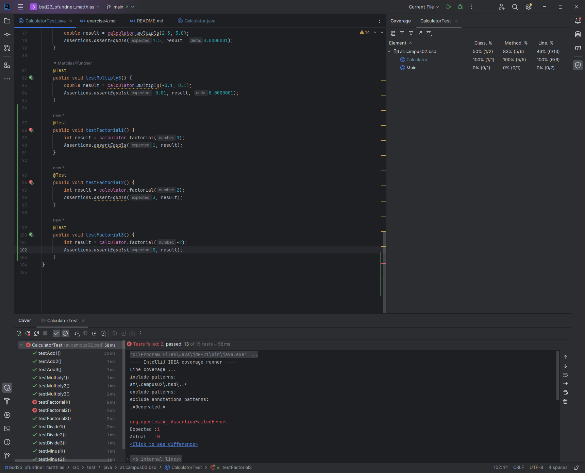

# Exercise 4

Testing a Java project with JUnit.

---

## Testing

Four methods are tested, each with three test methods.
The class that is tested here represents a simple calculator with the functions
**add()**, **minus()**, **divide()**, **multiply()**.

The 12 test cases check how the methods react to positive, negative and decimal numbers.

In addition, the **divide** method could be checked for the behavior of a zero division
and whether the corresponding exception is thrown. But this is not included in this exercise.

---

## Screenshots

 All tests successful

---

 Not all tests successful