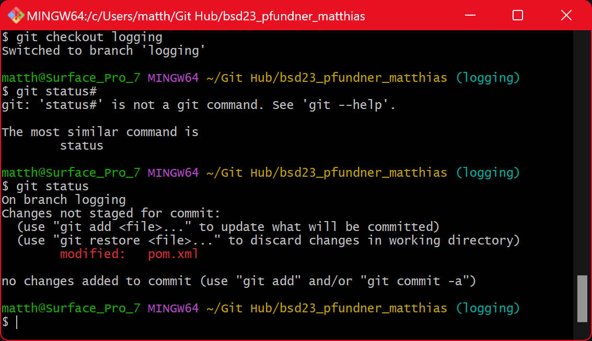
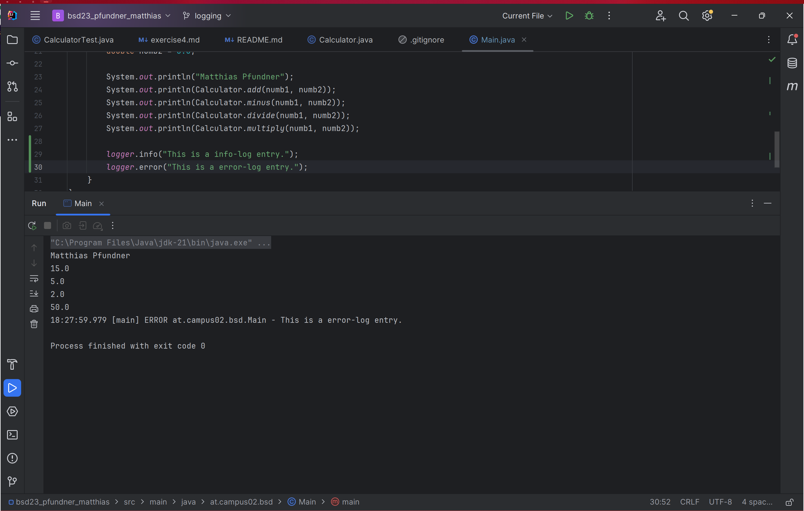
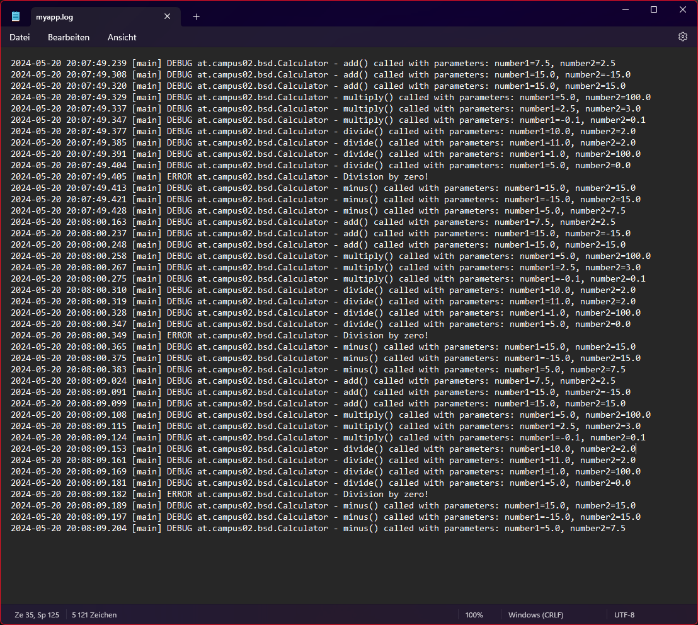
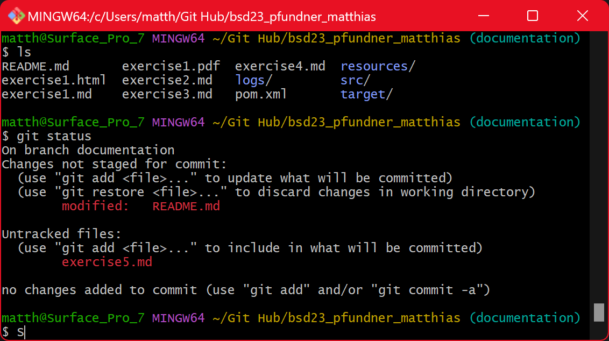

# Exercise 5

Documentation of the exercise "Logging"

---

## Why are logging libraries used?

Logging libraries are used to record runtime information, diagnose issues and monitor performance.

---

## What log levels are there in Log4J and what are they all about?

1. TRACE: Very detailed diagnostic information.
2. DEBUG: Information useful for debugging.
3. INFO: General operational information.
4. WARN: Indications of potential issues.
5. ERROR: Errors that do not stop the application.
6. FATAL: Critical errors causing application shutdown.

---

## What configuration options does log4J offer?

1. Configuration files: XML, JSON, YAML, and Properties files.
2. Appenders: Define where logs are written (console, file, database).
3. Loggers: Control logging behavior for different parts of an application.
4. Layouts: Format log messages (pattern, XML, JSON).
5. Filters: Include or exclude log messages based on criteria.

---

## Screenshots

 Shows that I am in branch logging

---

 Shows my first logging message in the console

---

 Shows the logging entries in the generated log file

---

 Shows that I am in branch documentation