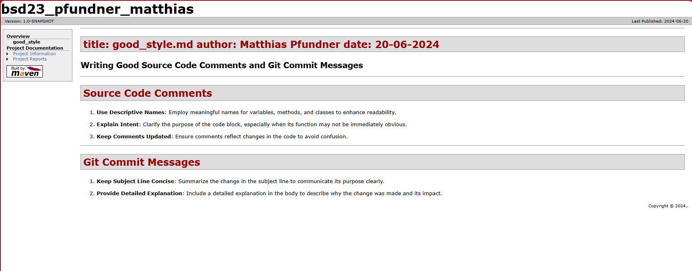
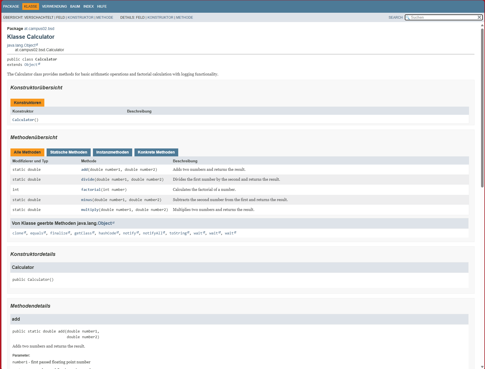
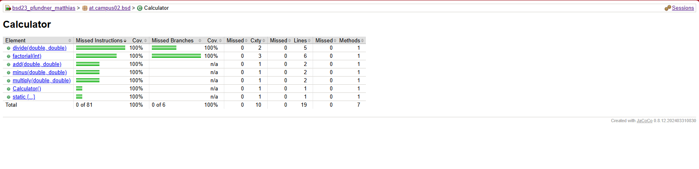

# Exercise 6

Configuration aspects for Maven Site Documentation

---

## Steps to generate the Maven Site Documentation

1. Prepare the Project (All unnecessary files are excluded).
2. Configure pom.xml (Add necessary Maven Site plugins).
3. Create Markdown Files for Additional Content.
4. Configure site.xml.
5. Generate Javadoc and Test Results.
6. Run Maven Site Command.
7. Verify the Maven Site.

---

### Configuration in site.xml or pom.xml

In the configuration files site.xml or pom.xml, various aspects are defined:

- **Plugins for Maven Site Generation**: Configuration of Maven Site plugins.
- **Markdown Pages and Their Linking**: Definition of Markdown pages and their placement in the Maven Site structure.
- **Integration of Javadoc**: Configuration of maven-javadoc-plugin for generation and integration of Javadoc documentation.
- **Integration of JUnit Test Results**: Use of plugins for integrating test results into the Maven Site.

---

## Screenshots

 Shows the good_style.md in the maven site documentation

---

 Shows the Javadoc API-Help in the maven site documentation

---

 Shows the JUnit-testreport in the maven site documentation